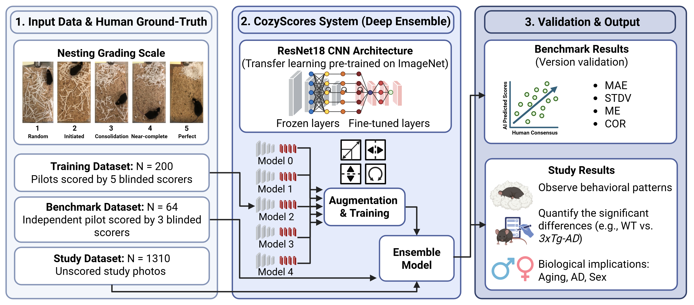

# 🐭 CozyScores: Deep Learning Nest Quality Scoring



CozyScores is a PyTorch-based pipeline designed for automated, high-throughput scoring of mouse nesting behavior. By using an ensemble of ResNet18 models, it provides both a predicted score (1.0–5.0) and a measure of confidence (Standard Deviation) for every cage photo.

---
## 🛠️ Environment Setup

To ensure CozyScores runs with the exact library versions used during validation, follow these steps to set up your local environment.

1. **Create the Environment:**
    ```Bash
    conda create -n cozyscores_env python=3.10 -y
    conda activate cozyscores_env
    ```
    
2. **Install Dependencies:**
    Navigate to your local CozyScores directory and run:
    ```Bash
    # Replace the path below with your actual folder location
    cd path/to/your/CozyScores
    pip install -r requirements.txt
    ```    
---
## 📂 Project Structure

CozyScores uses a "Central Engine" architecture. The scripts stay in the root, while your experimental data lives in `projects/`.
```text
CozyScores/
├── cozyscores/          # The Engine (predict.py, train.py, utils.py)
├── models/              # Trained weights
│   └── v4/              # Production version (validated in Miot & Shih et al.)
│   └── ...              # (Future semantic versions v1.x.x will go here)
└── projects/
    └── SKA-31/          # Example experiment
    │   ├── config.yaml  # Project-specific overrides
    │   ├── data/
    │   │   ├── scored_photos/    # TRAINING DATA (Subfolders required)
    │   │   └── unscored_photos/  # INFERENCE DATA
    │   └── results/              # Output CSVs and Plots
    └── ...              # (Add new experiment folders here)
```
---
## ⚙️ Configuration Magic

CozyScores uses a **Two-Tier Configuration** system:

1. **`base_config.yaml`**: Located in the engine folder. Contains defaults for learning rate, image size (1024), and ensemble size (5).
    
2. **Project `config.yaml`**: Located in your project folder. It only needs to contain things specific to that project (like `project_name`). It automatically inherits everything else from the base.
    
---
## 🚀 Usage Guide

### 1. Preparing Data for Training

To train the model, your `scored_photos/` directory **must** use subdirectories. Each subdirectory should contain a `scores.csv`.

- **CSV Requirement:** Must have a column named `filename` (or `image`) and `average_score` (or `score`).
    
- **Format Support:** Native support for `.jpg`, `.png`, and `.heic` (iPhone photos).
    
### 2. Training an Ensemble

Train multiple models at once to ensure statistical robustness.

```Bash
python cozyscores/train.py --config projects/YOUR_PROJECT/config.yaml
```

- Uses **Tukey Biweight Loss** to remain robust against outlier manual scores.
    
- Automatically performs an 80/20 train/validation split.
    
- Saves the best weights for each ensemble member to `models/v4/`.
    

### 3. Evaluation & Validation

Verify how well the AI matches human intuition.

```Bash
python cozyscores/evaluate.py --config projects/YOUR_PROJECT/config.yaml
```

- Generates a **Regression Plot** (Actual vs. Predicted) in your `results/` folder.
    
- Calculates **$R^2$** and **Mean Squared Error (MSE)**.
    

### 4. Predicting New Scores (Inference)

The primary tool for your research.

```Bash
python cozyscores/predict.py --config projects/YOUR_PROJECT/config.yaml
```

- **Output:** A `predicted_scores.csv` in your results folder.
    
- **Confidence Metrics:** Includes the `mean_score` from the ensemble and the `std_dev`. A high standard deviation indicates the model is "unsure" and you should manually check that specific cage.
    
---
## 🔬 Core Technologies

- **Backbone:** ResNet18 (Pre-trained on ImageNet).
    
- **Activation:** Scaled Sigmoid (forces outputs to stay between 1.0 and 5.0).
    
- **Preprocessing:** Letterbox Resizing (preserves aspect ratio without stretching the cage dimensions).

- **Illustrations:** Figure created with BioRender.com
    
---
## 🎓 Citation

If you use CozyScores in your research, please cite:
> Miot & Shih et al (TBD). TITLE. [In Review/Journal].

---
## ⚖️ License & Acknowledgements
- Distributed under the **MIT License**. See `LICENSE` for more information.
- Illustrations created with **BioRender.com**.
- Lab volunteers who helped with shredding.

---
## 📝 Lab Notes & Troubleshooting

- **New Projects:** To start a new project, simply copy the `projects/SKA-31` folder structure and update the paths in the new `config.yaml`.
    
- **HEIC Files:** If using newer iPhones, HEIC support is handled automatically via `pillow-heif`.
    
- **Pathing:** Always run scripts from the **root** `CozyScores/` directory to ensure Python can resolve the internal module paths correctly.